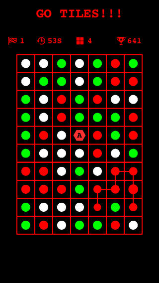
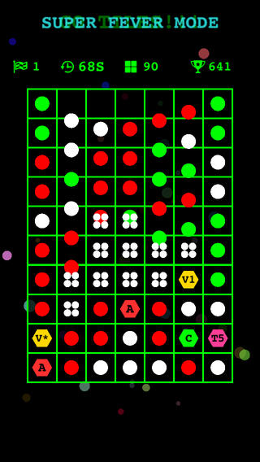
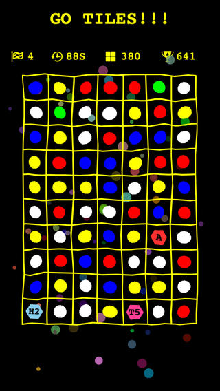
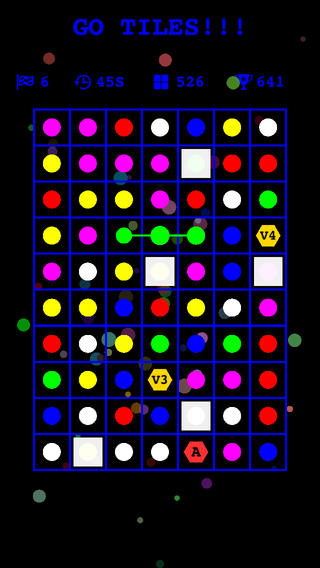

### GoTiles

A classic puzzle game made with `Cocos2d-html5` + `JSB` + `Parse` and was ported to serveral different platforms using `Node-Webkit`.

[A live demo is here.](http://supersuraccoon.github.io/GoTiles/)

There is a [post](http://www.supersuraccoon-cocos2d.com/2013/10/13/cocos2d-html5-node-webkit/) on my blog talking about using `Node-Webkit` to port `cocos2d` game to desktop.
